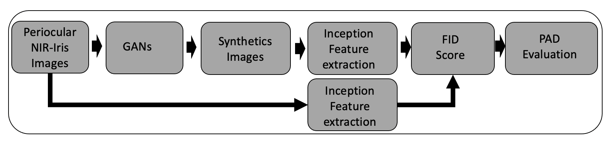
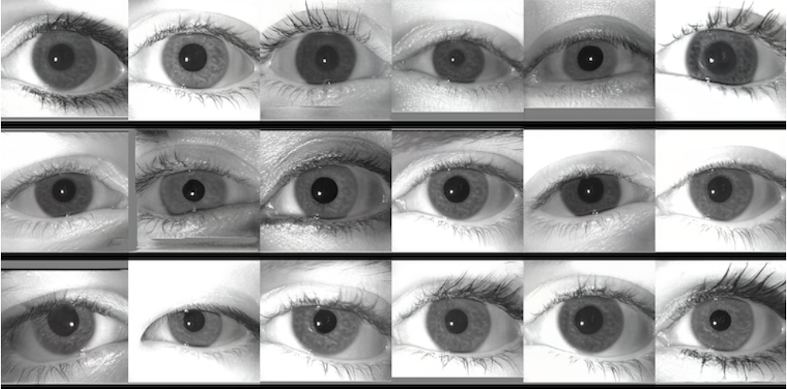

# Analysis of the Synthetic Periocular Iris images for Robust Presentation Attack Detection Algorithms

### Authors: Jose Maureira, Juan E. Tapia, Claudia Arellano, Christoph Busch.

## Abstract


<p style="text-align: justify;">The LivDet-2020 competition focuses on Presentation Attacks Detection (PAD) algorithms and has still open problems, mainly unknown attack scenarios. It is crucial to enhance PAD methods. This can be achieved by augmenting the number of Presentation Attack Instruments (PAI) and bona fide (genuine) images used to train such algorithms. Unfortunately, the capture and creation of PAI and even the capture of bona fide images are sometimes complex to achieve because of privacy complexity. The generation of synthetic images with GAN algorithms may help and has shown significant improvements in recent years. This paper presents a benchmark of GAN methods to achieve a novel synthetic PAI from a small set of periocular NIR images. The best PAI was obtained using StyleGAN2, and it was tested using the best PAD algorithm from the LivDet-2020. The synthetic PAI was able to fool such an algorithm. As a result, all images were classified as bona fide. A MobileNetV2 was trained using the synthetic PAI as a new class to achieve a more robust PAD. The result PAD was able to classify 96.7% of synthetic images as attacks. BPCER10 was 0.24%. Such results demonstrated the need for PAD algorithms to be constantly updated and trained with synthetic images.</p>

<p>
    
    <em>Proposal framework to generated a Synthetic PAI using GAN algorithms. The synthetic images are evaluated using a FID score and the best PAI is tested using state-of-the-art PAD algorithms.</em>
</p>

## Dataset

For this paper, and for all GAN methods implemented, the GFI-UND database was used. This database is organized in 3,000 NIR periocular Iris images with a resolution of 640 × 480, captured with an LG-4000 capture device. The database is equally distributed with 1,500 left and 1,500 right NIR iris images. The database is also gender-balanced, with 750 males and 750 females subject-disjoint. For all training methods, the input to the GANs were 3,000 images. A probabilistic data-augmentation based on imgaug library a high occurrence rate (p : 0.75) was used in all experiments.

## Synthetics Image generation

The synthetic iris images generated with the StyleGAN2 model that obtained the best fid score which was trained with the following parameters:


| kIMGS | Learning rate | Optimizer |Pre-trained model?| Dataset| FID |
| --- | --- | --- | --- | --- | --- |
| 3,600 | 0.0025 | Adam  | Yes | GFI-UND | 16.29 |

The dataset used in this paper of 3000 synthetically generated iris images with the best StyleGAN2 model is available in Downloads section.

Used implementation of StyleGAN2: [Here](https://github.com/NVlabs/stylegan2-ada-pytorch)

## Paper

[Link IET](https://ietresearch.onlinelibrary.wiley.com/doi/abs/10.1049/bme2.12084)

## Downloads

- Best model StyleGAN2 (FID = 16.29): [Download](https://drive.google.com/file/d/1QVZ2QIOGj1IEmDUTvTncRO0h1iy1By3B/view?usp=sharing). (The file password should be required to juan.tapia-farias@h-da.de).
- Dataset 3000 synthetic iris images: [Download](https://www.dropbox.com/s/uag9fjp5dk0guct/StyleGan-Iris-PADv1.zip?dl=0) (The file password should be required to juan.tapia-farias@h-da.de).
- GFI-UND database: [Download request](https://cvrl.nd.edu/projects/data/#the-gender-from-iris-dataset-nd-gfi) (With the permission of University of Notre Dame-UND).


### Example of synthetic image with size of 250x250 pixels generated using StyleGAN2:

<p align="center">
	
	<em>Example of 18 synthetic iris images using the best model with StyleGAN2.
	</em>
</p>


## Citation

```
@article{https://doi.org/10.1049/bme2.12084,
author = {Maureira, Jose and Tapia, Juan E. and Arellano, Claudia and Busch, Christoph},
title = {Analysis of the synthetic periocular iris images for robust Presentation Attacks Detection algorithms},
journal = {IET Biometrics},
volume = {n/a},
number = {n/a},
pages = {},
doi = {https://doi.org/10.1049/bme2.12084},
url = {https://ietresearch.onlinelibrary.wiley.com/doi/abs/10.1049/bme2.12084},
eprint = {https://ietresearch.onlinelibrary.wiley.com/doi/pdf/10.1049/bme2.12084},
}
```

## Disclaimer
The dataset, the implementation, or trained models used is restricted to research purposes. Using the dataset or the implementation/trained models for product development or comercial product is not allowed. This project is licensed under the terms of the Attribution-NonCommercial-ShareAlike 4.0 International (CC BY-NC-SA 4.0) license.

## Contact info

If you have any questions, you can contact us at the following emails:

- juan.tapia-farias@h-da.de
- jose.maureira@tocbiometrics.com


