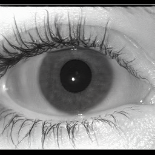

# Analysis of the Synthetic Periocular Iris images for Robust Presentation Attack Detection Algorithms

## Authors: Jose Maureira, Juan E. Tapia, Claudia Arellano, Christoph Busch.

The LivDet-2020 competition focuses on Presentation Attacks Detection (PAD) algorithms and has still open problems, mainly unknown attack scenarios. It is crucial to enhance PAD methods. This can be achieved by augmenting the number of Presentation Attack Instruments (PAI) and bona fide (genuine) images used to train such algorithms. Unfortunately, the capture and creation of PAI and even the capture of bona fide images are sometimes complex to achieve because of privacy complexity. The generation of synthetic images with GAN algorithms may help and has shown significant improvements in recent years. This paper presents a benchmark of GAN methods to achieve a novel synthetic PAI from a small set of periocular NIR images. The best PAI was obtained using StyleGAN2, and it was tested using the best PAD algorithm from the LivDet-2020. The synthetic PAI was able to fool such an algorithm. As a result, all images were classified as bona fide. A MobileNetV2 was trained using the synthetic PAI as a new class to achieve a more robust PAD. The result PAD was able to classify 96.7% of synthetic images as attacks. BPCER10 was 0.24%. Such results demonstrated the need for PAD algorithms to be constantly updated and trained with synthetic images.

## Example of synthetic images with size of 250x250 pixeles generated using StyleGAN2:

